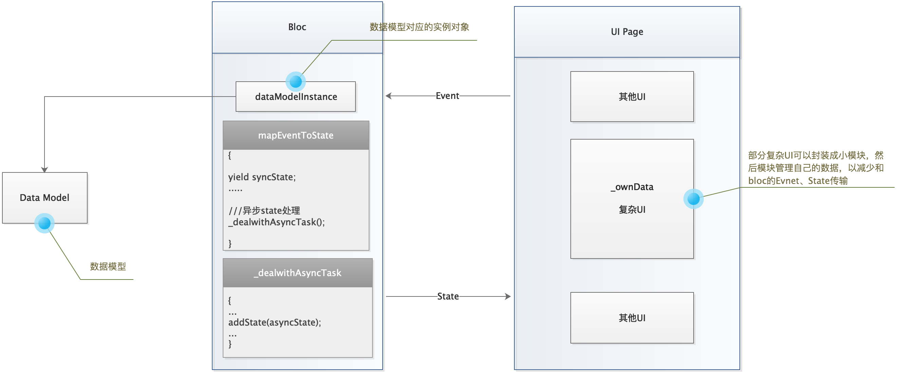
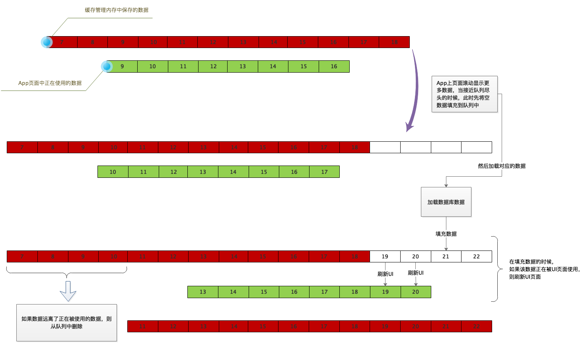

# flutter 项目思考
## 文件夹结构
* fonts 
* assets
    - images
    - files
* lib
    - dart_class
        + abstract
        + extension
        + mixin
    - styles
    - widgets
    - const
    - main
      - login
        - bloc
        - model
        - widget
        - login.dart
    - router
    - lifecycle
    - expanded
      - database
      - network_api
      - jpush
    - util
* local_packages
    
>**fonts:** 放自定义的字体文件，如平方字体
>**assets:** 
>   - images : 放置图片资源
>   - files : 放置文件资源，如省市区信息的json文件
> 
>**local_packages:** 放置本地包，第三方包有问题或者不完全适合使用，可以下载下来修改后放到该文件夹下，并在项目中引入
>**lib/dart_class:** 放置纯dart相关的类，flutter小部件相关的放到widgets文件夹中
>**lib/styles:** 放置样式相关的内容，如自定义常用的color、theme等
>**lib/widgets:** 放置封装widget，弹框、省市区选择、日历等
>**lib/const:** 放置定义的一些常量，如全局用的枚举、网络请求路径等
>**lib/main:** 放置app实际显示的各页面相关代码。如上面所示的登录。
>   - login
>       - bloc 放置bloc相关类文件
>       - model 放置数据模型文件
>       - widget 登录模块封装的小部件
>       - login.dart 登录页面的UI构建
>
>**lib/router:** 路由管理
>**lib/lifecycle:** 放置管理app生命周期的类文件，app进入后台或者从后台进入前台、登陆、退出账号等情况可能需要进行数据库、极光、mqtt等的一些初始化或暂停等操作，所以统一放到一处处理这些事件，以方便维护
>**lib/expanded:** 扩展文件夹，放置网络、数据库、极光等依赖第三方的封装
>**lib/util:**  放各种工具函数的文件夹

## 集合类、字符串
```
extension IterableExtension<E> on Iterable<E> {
  bool get isNotNullAndEmpty {
    if (this == null) {
      return false;
    } else {
      return isNotEmpty;
    }
  }

  E get firstOrNull => isNotNullAndEmpty ? first : null;

  int get notNullLength => this == null ? 0 : length;
}

extension StringExtension on String {
  bool get isNotNullAndEmpty => this != null && this.isNotEmpty;
  bool get isNullOrEmpty => this == null || this.isEmpty;
  int get notNullLength => this == null ? 0 : this.length;
}
```

如上代码所示，可以通过extension将如`list != null && list.isNotEmpty`判断代码简化为`list.isNotNullAndEmpty`；集合类如果为null，取first的时候是会报错的，通过extension拓展firstOrNull方法可以避免此类错误。

其他一些类也可通过extension来简化代码的编写


## Bloc 

##### mapEventToState

经过实践，发现在mapEventToState方法中处理异步的state很麻烦。用await的话会阻塞mapEventToState方法，如果不await，后期通过其他event把state带到mapEventToState中又会导致多创建没什么实际意义的event。

所以通过mixin给Bloc添加addState方法，让bloc可以跳过event直接传输state
```
mixin BlocAddStateMixin<E, T> on Bloc<E, T> {
  void addState(T nextState) {
    Transition<E, T> transition = Transition<E, T>(
      currentState: state,
      event: null,
      nextState: nextState,
    );
    if (transition.nextState == state) return;
    try {
      onTransition(transition);
      // ignore: invalid_use_of_visible_for_testing_member
      emit(transition.nextState);
    } on dynamic catch (error, stackTrace) {
      onError(error, stackTrace);
    }
  }
}
```

**思考 ：** 页面数据放StatefulWdiget的state类中还是放bloc中？
按个人理解，按bloc的设计思路，数据和逻辑应该都是放在bloc中的。但是实际开发中有些页面会有许多的修改项，如果把数据都放在bloc中，那所有的编辑修改都需要通过`event->state`来实现，这样子就需要建很多的event和state，代码会显得臃肿，还不如直接将数据放到StatefulWdiget的state中，各种编辑修改都反映到数据中，然后通过setstate刷新UI。
**bloc 总结 :** 使用`event->state`来进行状态管理，但是某些复杂页面或模块（如编辑修改等逻辑多的）可以视为一个小模块，模块管理自己相应的数据，模块外的状态管理还是使用`event->state`来进行。




## 网络请求
* #####  退出页面取消网络请求
  如下，自定义dio网络请求的CancelToken，bloc和state改为可监听close和dispose的，如此可通过CustomCanceltoken监听bloc或state的close或dispose，从而取消网络请求

```
  class CustomCanceltoken extends CancelToken {
  final DisposeListenable listenableDispose;
  VoidCallback _disposeListener;
  CustomCanceltoken({this.listenableDispose}) {
    if (listenableDispose != null) {
      _disposeListener = (() {
        cancel();
        listenableDispose.removeListener(_disposeListener);
      });
      listenableDispose.addDisposeListener(_disposeListener);
      whenCancel.then((onValue) {
        listenableDispose.removeListener(_disposeListener);
      });
    }
  }

  bool _isCompleted = false;
  bool get isCompleted => _isCompleted || isCancelled;
  ///封装的dio网络请求完成后调用此方法删除监听
  void close() {
    _isCompleted = true;
    listenableDispose.removeListener(_disposeListener);
  }
}

```

```
abstract class BlocCloseNotificationsAbstract<E, T> extends Bloc<E, T> with DisposeListenable {
  BlocCloseNotificationsAbstract(T initialState) : super(initialState);
  @override
  Future<void> close() {
    notifyListeners();
    disposeDisposeListenable();
    return super.close();
  }
}
```

```

abstract class StateDisposeNotificationsAbstract<T extends StatefulWidget> extends State<T> with DisposeListenable {
  @override
  void dispose() {
    notifyListeners();
    disposeDisposeListenable();
    super.dispose();
  }
}
```


* ##### 相关逻辑代码放一块
  网络请求经常会涉及的是上下拉刷新、对网络请求结果弹框提示的逻辑。按bloc `event->state`的思路，在代码某处添加一个请求网络数据的event，然后在其他地方接收一个网络请求结果的state并处理弹框提示等；或者直接在bloc中就进行弹框提示等。

  但是这样子就将发起网络请求和对请求结果做弹框提示或者停止上下拉操作分割到两处了。个人感觉这样子代码逻辑不够清晰。

  如下，创建回调类
```
class BindStateCallback<T> {
  final State state;
  final ValueChanged<T> _callback;
  BindStateCallback({@required this.state, @required ValueChanged<T> callback})
      : assert(state != null && callback != null),
        _callback = callback;

  void call(T value) {
    if (state?.mounted == true && _callback != null) {
      _callback(value);
    }
  }
}
```
网络请求或者其他业务处理的event(如下NetworkEvent)带上BindStateCallback参数，在网络请求结束后通过回调`networkEvent.bindCallback?.call(true)`将网络请求结果回传
```
class NetworkEvent extends BlocEvent {
  final BindStateCallback<bool> bindCallback;
  NetworkEvent(this.bindCallback);
}
```
处理网络请求提示等如下处理
```
bloc.add(NetworkEvent(
      BindStateCallback(
        state: this,
        callback: (result) {
          if (result) {
            ///网络请求成功提示等操作
          } else {
            ///网络请求失败提示等操作
          }
        },
      ),
    ));
```

**备注：** 网络请求得到的数据和需要执行的刷新还是通过bloc state传递，BindStateCallback只是回传网络请求的成功失败结果。


## 路由管理

### 为了达到的目的：
* 使用`popUntil`等和路由名称相关的方法
* 判断当前widget或者state是否是App正在显示的页面 
* 新接手项目的成员可以快速找到相关页面

>不使用 `Navigator.pushNamed(context, 'routeName',arguments:arguemntsOjbect);`和`onGenerateRoute`组合的原因是：`pushNamed`传参麻烦；没有参数类型提示；且通过`pushName`跳转页面的话不能通过代码直接跳到相应页面（如通过`pushName`跳转到A页面，那在`pushName`代码处不能通过点击A类名跳转到A类代码处）。

### 用法
* 监听路由跳转
```
MaterialApp(
      navigatorObservers: [CustomNavigatorObserver()],
)
```
* 跳转到页面A
```
Navigator.of(context).push(Router.routeForPage(page:PageA(),),);
```

* 跳转到页面A，同时传递Bloc
```
Navigator.of(context, rootNavigator: true).push(
      Router.routeForPage(
          page: PageA(),
          pageWrapBuilder: (page, _) => BlocProvider(
                  create: (context) => bloc,
                  child: page,
          ),
      ),
);
```


* 跳转到页面A，同时自定义Route
```
Navigator.of(context, rootNavigator: true).push(
      Router.routeForPage(
          page: PageA(),
          customRouteBuilder: (pageBuilder, settings) => CustomRoute(
                settings: settings,
                pageBuilder: (builderContext, _, __) => pageBuilder(builderContext),
              ),
      ),
);
```

* 返回页面A
```
Navigator.popUntil(context, Router.filterRoute(Router.pageA));
```
* 判断页面A是否在路由最顶层，也就是正在显示页面A
```
Router.isPageAtTop(context，[PageA页面对应的widget或者state对象])
```


## ListView等列表数据缓存管理
### 目的
* 列表数据量很多（几千或者过万）的时候进行本地数据缓存管理，以减少内存占有量。
* 实现列表数据的预加载

## 主要原理




* 红色部分为存储在内存中的数据
* 绿色表示App正在使用的数据（包括屏幕上显示的和列表预加载的）
* 缓存使用队列管理，以利于添加和删除数据
* 队列中缓存的是以下对象：
```
class ListCacheItem<T> extends LinkedListEntry<ListCacheItem> {
  int index;
  ///列表中使用和数据库中存储的都是data数据
  T _data;
}
```
* 列表中使用和数据库中存储的都是`ListCacheItem`中的`_data`数据


 
##### 主要设计思路如上图所示。其流程如下：
（1） 从数据库请求首页数据，将数据转换成`ListCacheItem`存储到队列中的同时保存到本地数据库
（2） 列表往上滚动，当列表显示或者预加载的数据快到末尾的时候执行网络请求加载更多
（3） 将服务器返回的数据转换成`ListCacheItem`存储到队列末尾，并保存到数据库。同时删除队列头部不再被列表使用的数据
（4） 如果继续往上滚动，重复第（2）和第（3）步

（5）如果往下滚动，则判断列表使用的数据是否接近队列头部了，如果接近了就先往头部填充`ListCacheItem`(此时`_data`为空)，然后从数据库加载对应的数据，得到数据后判断对应的`ListCacheItem`是否还在队列中，如果还在就将数据传递给对应的`_data`，同时判断数据是否正被列表使用（则正在被用于构建UI），如果正被列表使用就执行UI刷新操作。同时删除队列尾部不再被列表使用的数据

(6) 如果往上滚动，则逻辑类似步骤（5）或者步骤（2）

### 相关widget
* 列表中的item要包裹在`ListCacheBuilder`中

**备注**：mount的时候执行的`_checkIndex`方法是检查对应的`ListCacheItem`是否在队列范围内，如果超出了，则队列缓存数据要做处理，以保证列表正在使用的数据都在队列缓存中。设计该逻辑的原因是flutter中的列表会自动缓存部分widget，也就是列表滚动过程中，UI的显示不一定执行children的创建。为了准确知道当前列表显示那些数据，所以在mount的时候做检查判断。


## 滚动列表的一些数据获取
* 比如需求：列表下面有一个按钮，要求当页面UI不超过屏幕的时候按钮在屏幕下方，当页面UI超过屏幕高度的时候，按钮在列表最后面。
  
要实现这需求就需要知道列表前面渲染的UI是否超出范围了。此时可以定义如下的Sliver类，viewportHeight是滚动视窗的高度，也就是CustomScrollView的高度，precedingScrollExtent是在该sliver之前CustomScrollView已经渲染了多高的UI。此时就可以在heightBuilder中通过计算返回CustomViewportSliver的高度。
```
const CustomViewportSliver({
    Key key,
    Widget child,
    this.heightBuilder,
  }) : super(key: key, child: child);
  final double Function(double viewportHeight,double precedingScrollExtent) heightBuilder;
```

其实滚动列表内部都是通过viewport实现的，而RenderSliver中的constraints提供了获取viewport的一些信息的字段，详见下面源码
```
abstract class RenderSliver extends RenderObject {
  // layout input
  @override
  SliverConstraints get constraints => super.constraints as SliverConstraints;
}
```
```
const SliverConstraints({
    @required this.axisDirection,
    @required this.growthDirection,
    @required this.userScrollDirection,
    @required this.scrollOffset,
    @required this.precedingScrollExtent,
    @required this.overlap,
    @required this.remainingPaintExtent,
    @required this.crossAxisExtent,
    @required this.crossAxisDirection,
    @required this.viewportMainAxisExtent,
    @required this.remainingCacheExtent,
    @required this.cacheOrigin,
  })
```

因此，其他类似此类的需求都可以通过继承RenderSliverSingleBoxAdapter实现自定义RenderObject，在RenderObject中将viewport的信息回传到widget上辅助计算
`abstract class RenderSliverSingleBoxAdapter extends RenderSliver with RenderObjectWithChildMixin<RenderBox>, RenderSliverHelpers {
`


## 跨页面事件传递

由于新版本bloc改为依赖cubit实现，所以跨页面间事件的传递及相应页面刷新可以使用cubit实现，不用再多加eventbus的使用了

## GridView的适配

其中一种情景：GridView中使用`SliverGridDelegateWithFixedCrossAxisCount`,因为高度是通过宽度按一定比例计算出来的，所以窄的屏幕上很可能会出现网格高度不够的情形。

其实网格的宽高等数据都是通过`SliverGridLayout getLayout(SliverConstraints constraints);`此方法计算出来的，如上面的情景，可以自定义SliverGridDelegate，设定最小高度，则在窄屏中也保证网格高度大于等于最小高度，这样子就不会出现layout报错了。其他类似需求也可以在getLayout方法中自定义计算规则

```
abstract class SliverGridDelegate {
  /// Abstract const constructor. This constructor enables subclasses to provide
  /// const constructors so that they can be used in const expressions.
  const SliverGridDelegate();

  /// Returns information about the size and position of the tiles in the grid.
  SliverGridLayout getLayout(SliverConstraints constraints);

  /// Override this method to return true when the children need to be
  /// laid out.
  ///
  /// This should compare the fields of the current delegate and the given
  /// `oldDelegate` and return true if the fields are such that the layout would
  /// be different.
  bool shouldRelayout(covariant SliverGridDelegate oldDelegate);
}
```